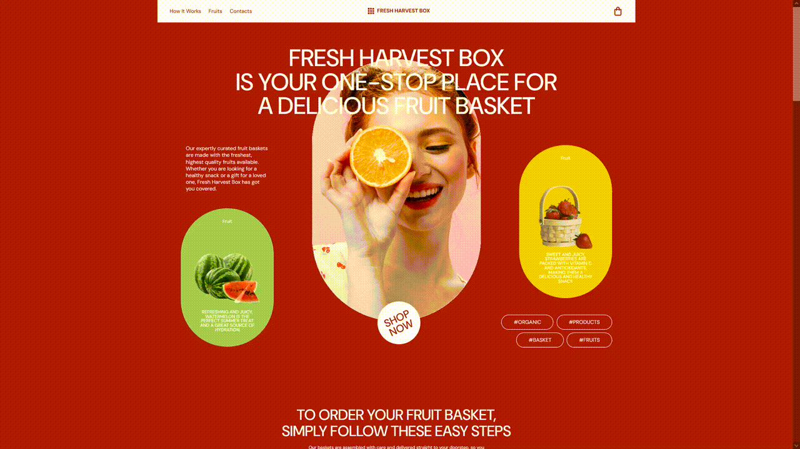

  

# О проекте

Адаптивный лендинг магазина, продающего различные фрукты. Верстка и стили выполнены без использования дополнительных фреймворков. Именования классов выполнены в соответствии с методологией БЭМ.

Открыть страницу: https://linacor.github.io/fruits-store/

# Функциональность
Логика выполнена на чистом JavaScript без использования сторонних библиотек или фреймворков. Код разбит на отдельные модули, что обеспечивает более простую и понятную структуру. Подключение модулей осуществляется через файл main.js.
Реализованы следующие функции для пользователя:
- добавление товара в корзину,
- удаление товара из корзины,
- просмотр содержимого корзины,
- валидация введенного имени при оформлении заказа.

# Демонстрация 
## Desktop version
1. Просмотр страницы

2. Добавление товаров

3. Удаление товаров

4. Просмотр товаров

5. Валидация формы

## Mobile version

